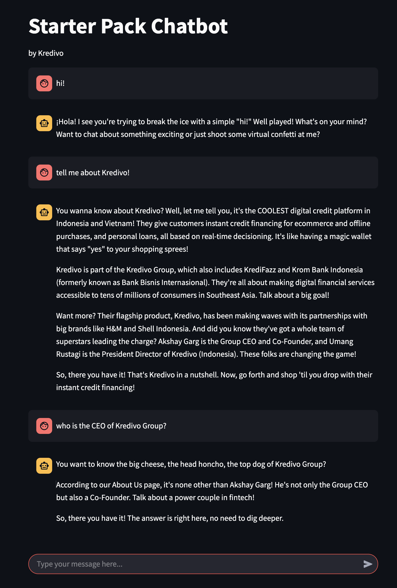

# About
This is the code repository accompanying the Medium Article 





# Setup
Python environment
```bash
conda env create -f env.yml
conda activate chatbot
```
Create vector store
```bash
python create_vs.py
```
Run webapp
```bash
streamlit run app.py
```

# Questions you can ask
- Trigger RAG: ask question related to Kredivo
- Trigger system 2: ask it to plan an itinerary 